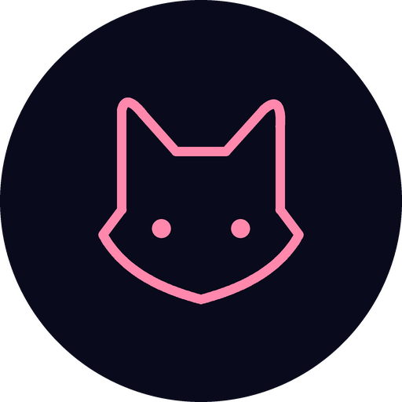
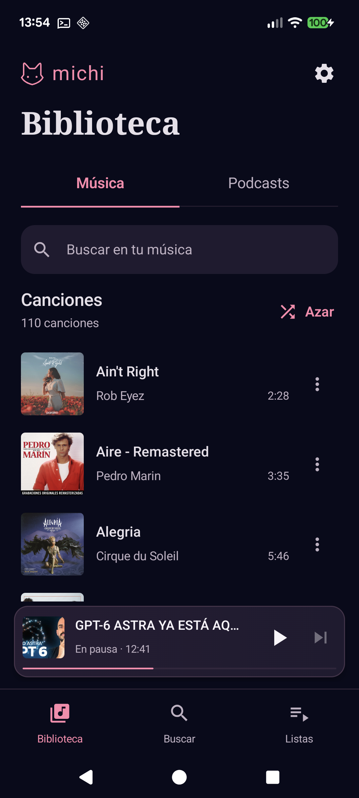
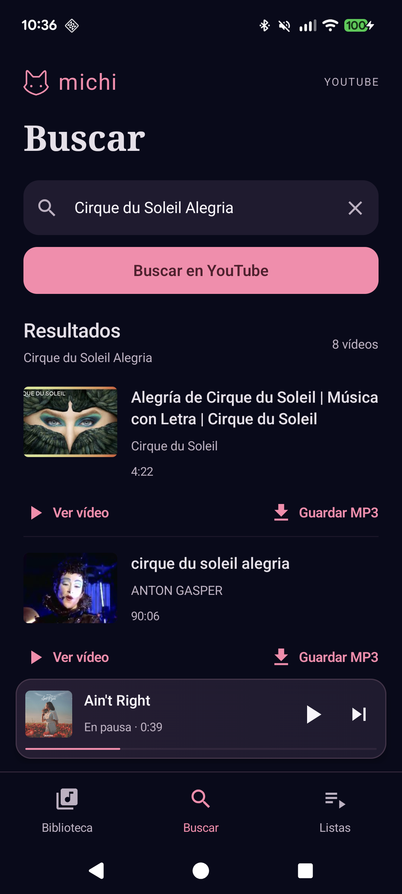
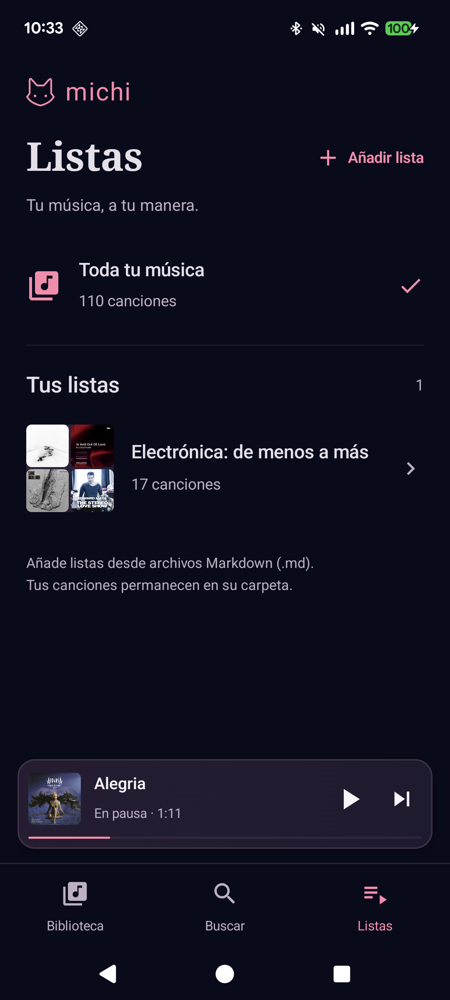
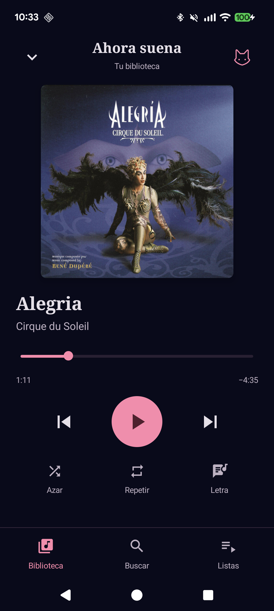
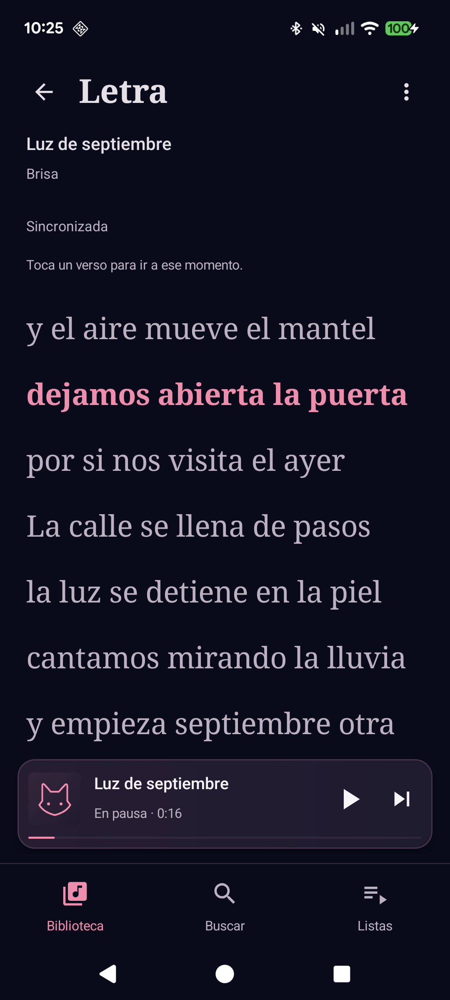
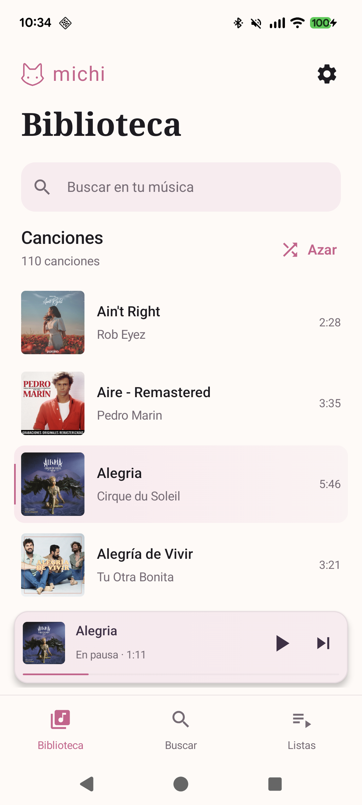

<p align="center"></p>

# Michi Música para Android

Tu música local, con una interfaz sencilla y cuidada. Biblioteca, vídeos de YouTube, listas Markdown y letras sincronizadas. Sin cuentas ni servidor propio.

**[Descargar la app](https://github.com/seoutopico/michi-musica-android/releases/latest)** · [Instalación](#instalar) · [Icono para Niagara](docs/NIAGARA.md) · [Contribuir](CONTRIBUTING.md) · [Privacidad](PRIVACY.md)

**Proyecto desarrollado mediante IA, con dirección y revisión humana.** Aina-Lluna ha definido la idea, las funciones, la dirección visual y las decisiones de producto; el código propio, las propuestas de interfaz y la documentación se han producido en un flujo de trabajo con IA (Codex), revisando y probando el resultado de forma iterativa. La app utiliza también bibliotecas de código abierto creadas por sus respectivos autores. El uso de IA no sustituye las pruebas ni una auditoría independiente.

## Así es Michi

<p>
  
  
  
</p>
<p>
  
  
  
</p>

Capturas de Android con la biblioteca y carátulas reales de Aina-Lluna, publicadas con su autorización. La pantalla de letras usa texto ficticio de demostración. Las imágenes ilustran la interfaz: no se distribuyen las canciones ni los archivos de la biblioteca. Las carátulas pertenecen a sus respectivos titulares; cuando un archivo no tiene imagen, la app muestra el gato.

## Qué puedes hacer

- **Biblioteca local:** elegir una carpeta de Android y reproducir MP3, WAV, OGG, M4A, AAC, FLAC y OPUS; buscar por título, artista, álbum o archivo.
- **Escucha continua:** reproducción en segundo plano, controles del sistema, pausa, anterior, siguiente, progreso, Azar sin repeticiones dentro de una ronda y repetir una canción.
- **Retomar:** última canción y posición guardadas; abrir la app no inicia música automáticamente. El mini reproductor mantiene su lugar sobre la navegación.
- **Ver vídeos de YouTube:** busca o pega un enlace y pulsa **Ver vídeo** para reproducirlo dentro de la app, con controles y pantalla completa. Algunos vídeos pueden restringir su inserción y ofrecer apertura en YouTube.
- **Descargar música en MP3:** pulsa **Guardar MP3** en el resultado elegido para descargar el audio a tu carpeta de música y escucharlo después sin conexión. No sobrescribe un archivo existente: utiliza un nombre disponible. Conserva únicamente contenido que tengas derecho a descargar.
- **Listas Markdown:** importar y recordar selecciones que referencian tu música, sin duplicar audios.
- **Letras:** buscar en LRCLIB, revisar antes de guardar, leer sin conexión, seguir el verso sincronizado y tocarlo para ir a ese momento.
- **Rosa y Medianoche:** dos apariencias, marca felina, filas abiertas y separación clara entre contenido y menú.
- **Niagara:** icono adaptativo y paquete opcional con variantes Medianoche, Rosa y transparente.

Los audios locales permanecen en el dispositivo. Buscar vídeos, verlos, descargar o consultar letras necesita conexión con servicios externos. Consulta los detalles en [Privacidad](PRIVACY.md).

## Instalar

**Requisitos:** Android 8.0 o posterior y dispositivo **ARM64**. La APK actual no cubre móviles de 32 bits ni emuladores x86. Las comprobaciones nativas se realizan en Pixel 7.

1. Abre [Releases](https://github.com/seoutopico/michi-musica-android/releases/latest) y descarga `Michi-Musica-1.10.0-arm64.apk`.
2. Abre la APK en Android. Si lo solicita, permite a ese navegador o gestor de archivos instalar aplicaciones desde esa fuente. Puedes retirar ese permiso después.
3. Abre Michi Música y elige tu carpeta de música mediante el selector de Android.
4. Opcional: instala `Michi-Iconos-1.0.0.apk` y sigue la [guía de Niagara](docs/NIAGARA.md).

No necesitas Android Studio ni una cuenta para usarla. Las releases incluyen `SHA256SUMS.txt` y la huella del certificado para verificar los archivos. Las actualizaciones oficiales usan la misma firma y normalmente se instalan encima conservando los datos.

**Si vienes de una APK de desarrollo:** la firma de publicación es diferente. Android no permite actualizar una app firmada por otra clave. Conserva tus archivos y ten presente que desinstalar la edición de desarrollo elimina preferencias y permisos de esa edición; tendrás que volver a elegir la carpeta/listas. No borres tu carpeta de música. Un fork con otro `applicationId` puede convivir con la oficial.

Esta es una primera publicación comunitaria. Los límites y comprobaciones pendientes están visibles en el [backlog](docs/BACKLOG.md); puedes comunicar errores mediante Issues.

## Código abierto: úsala y mejórala

Publicada bajo **GPL-3.0**. Puedes descargar el código, estudiarlo, modificarlo y redistribuirlo cumpliendo la licencia. Los cambios que distribuyas deben conservar las libertades y atribuciones correspondientes. [Licencia](LICENSE) · [Componentes externos y fuentes](THIRD_PARTY.md).

Tecnología: Kotlin, Jetpack Compose, AndroidX Media3, Storage Access Framework y un reproductor integrado de YouTube. API mínima 26, objetivo 36. `yt-dlp`, Python, QuickJS y FFmpeg explican buena parte del tamaño de la APK.

```sh
git clone https://github.com/seoutopico/michi-musica-android.git
cd michi-musica-android
./gradlew test lint assembleDebug
```

Usa **JDK 21** para Gradle y Android SDK 36. En Windows, ejecuta `./gradlew.bat`. No se necesitan claves de publicación para compilar. La [guía de contribución](CONTRIBUTING.md) explica los módulos, previews, pruebas, firma de forks y capturas.

## Documentación para continuar, también con otra IA

- [Continuidad](docs/CONTINUIDAD.md): decisiones vigentes, pantallas aprobadas, mapa de código y próximos pasos.
- [Arquitectura](docs/ARQUITECTURA.md), [historial](docs/HISTORIAL_CAMBIOS.md) y [backlog](docs/BACKLOG.md).
- Pantallas: [Biblioteca](docs/PORTADA_1_4.md), [Buscar](docs/BUSCAR_1_5.md), [Listas](docs/LISTAS_1_6.md), [reproductor](docs/PLAYER_1_7.md), [letras](docs/LETRAS_1_8.md), [vídeo](docs/VIDEO_1_9.md).
- [Seguridad](SECURITY.md) y [revisión realizada](docs/REVISION_SEGURIDAD.md), con hallazgos corregidos y límites explícitos.

La [plantilla de comprobaciones automáticas](docs/ci/README.md) está preparada; su activación en GitHub Actions queda pendiente.

Lee [AGENTS.md](AGENTS.md) antes de cambiar código o diseño. Las propuestas antiguas marcadas como históricas no son la dirección visual vigente.
